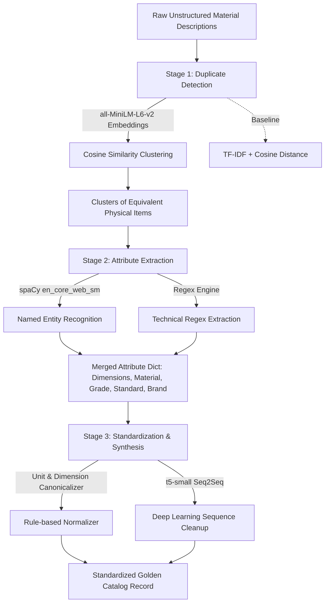

# DEWRO — Material Description Harmonization

<div align="center">

[](https://dewro-230c0.containers.snapdeploy.app/)
[](https://www.python.org/)
[](https://flask.palletsprojects.com/)
[](https://huggingface.co/sentence-transformers/all-MiniLM-L6-v2)
[](https://github.com/Gigaberg/Dewro/blob/main/Dockerfile)

**An end-to-end NLP & Deep Learning pipeline that identifies duplicate industrial material descriptions, extracts technical attributes, and standardizes them into structured golden catalog records.**

[🚀 **Launch Live Web App**](https://dewro-230c0.containers.snapdeploy.app/) • [📖 Pipeline](#-pipeline-architecture) • [📊 Datasets](#-datasets) • [💻 Local Setup](#-local-development)

</div>

---

## 📌 Problem Statement

In heavy industries (such as oil & gas, manufacturing, and energy like ONGC, IOCL, NTPC), procurement and inventory systems accumulate thousands of catalog entries with inconsistent, unstructured text descriptions for identical physical items. 

> *Example:* 
> - `"HEX BOLT M12 X 50 SS316 DIN 933"`
> - `"SS 316 Hexagonal Head Bolt Size: 12x50mm DIN-933"`
> - `"BOLT, HEX HD, 316 STAINLESS, M12X50"`

These describe the exact same physical spare part, but because of differing naming conventions, vendors, and legacy systems, enterprise resource planning (ERP) databases register them under disparate material codes. This leads to duplicate stock purchases, bloated working capital, and supply chain inefficiencies.

**DEWRO** solves this problem by automatically clustering duplicate material entries, extracting granular technical parameters (dimensions, material grades, standards, units), and standardizing them into a single clean reference record.

---

## 🌐 Live Deployment

The interactive web application is live and hosted on Snapdeploy:

🔗 **[https://dewro-230c0.containers.snapdeploy.app/](https://dewro-230c0.containers.snapdeploy.app/)**

- **Frontend:** Glassmorphism UI styled with Tailwind CSS, custom blur filters, dynamic tabbed views, and interactive JSON/CSV exports.
- **Backend:** Flask REST API (`server.py`) serving endpoints for semantic deduplication, entity extraction, text normalization, and dataset inspection.
- **Container:** Dockerized deployment with CPU-optimized PyTorch and lazy model loading.

---

## ⚙️ Pipeline Architecture



### 1. Semantic Duplicate Detection (`src/dedupe.py`)
- Employs `sentence-transformers/all-MiniLM-L6-v2` to map free-text descriptions into 384-dimensional dense semantic vectors.
- Clusters items with pairwise cosine similarity using Agglomerative Clustering (default threshold $\ge 0.78$).
- Includes a TF-IDF vectorizer baseline for academic comparison.
- **Auto-scaling:** inputs with more than 150 items automatically switch from MiniLM embeddings to TF-IDF. The neural model requires loading ~90MB into RAM and running a CPU forward pass per batch — above 150 items this exceeds the 30-second gateway timeout on free-tier hosting. TF-IDF runs entirely in-process with no model overhead and handles 1000+ items in under 2 seconds. The UI displays a notice when the switch occurs.

### 2. Attribute Extraction (`src/extract.py`)
- Dual-layer extraction pipeline:
  - **spaCy NLP (`en_core_web_sm`):** Identifies brands, organizations, and product entities.
  - **Deterministic Regex Rule Engine:** Captures engineering dimensions (`M12 x 50mm`, `1/2" OD`), material grades (`SS316`, `ASTM A193 B7`), industrial standards (`DIN 933`, `ISO 4017`, `ANSI B16.5`), and numeric ratings (`150#`, `Class 300`).

### 3. Standardization & Golden Record Synthesis (`src/standardize.py` & `src/pipeline.py`)
- **Unit Normalization:** Converts dimensional units into canonical formats (e.g. `mm`, `in`, `bar`, `psi`).
- **Deep Learning Text Cleanup:** Pretrained `t5-small` sequence-to-sequence model formats synthesized attribute fields into concise, consistent title strings.
- **Golden Record Assembler:** Merges cluster attributes by majority vote and synthesizes a structured output table.

---

## 🖥️ Web App Features

The live application provides five dedicated interactive modules:

1. **🔗 Full Harmonization Pipeline:** Paste arbitrary raw descriptions, select pre-loaded categories from the Flipkart industrial dataset, or upload custom CSVs. Inspect the generated golden records and export to CSV.
2. **🔍 Duplicate Detection:** Interactive clustering view with pairwise similarity score heatmaps, embedding vs. TF-IDF toggles, and cluster breakdown.
3. **🏷️ Attribute Extraction:** Real-time token highlighting and extracted key-value attribute inspection for dimensions, standards, materials, and grades.
4. **✨ Standardization:** Compare messy input strings side-by-side with rule-normalized values and T5 neural cleanup outputs.
5. **📁 Data Explorer:** Live table view and statistics for the four bundled benchmark datasets.

---

## 📊 Datasets

Located under [`Data/`](./Data/):

| Dataset | Type / Description | Purpose |
|---|---|---|
| **Flipkart E-Commerce** | Indian e-commerce descriptions with real-world noise | Unsupervised clustering & deduplication |
| **Abt-Buy** | Labeled product pair matches (`Abt.csv`, `Buy.csv`) | Entity resolution & matching benchmark |
| **Amazon-Google** | Labeled product pair matches | Entity resolution benchmark |
| **WDC PAVE** | Web Data Commons normalized attribute product corpus (`.jsonl`) | Attribute extraction validation |

---

## 📁 Repository Structure

```
DEWRO/
├── Data/                     # Benchmark datasets
│   ├── abtbuy/               # Abt-Buy entity matching dataset
│   ├── amazongoogle/         # Amazon-Google products dataset
│   ├── flipkart/             # Flipkart catalog sample
│   └── wdc/                  # WDC normalized attribute extractions
├── src/                      # Core NLP & ML pipeline modules
│   ├── data.py               # Dataset loaders and sampling utilities
│   ├── dedupe.py             # MiniLM & TF-IDF clustering
│   ├── extract.py            # spaCy NER + regex attribute extraction
│   ├── pipeline.py           # End-to-end orchestration
│   └── standardize.py        # Canonicalization + T5 seq2seq cleanup
├── web/                      # Production web frontend
│   ├── index.html            # Glassmorphic UI with Tailwind CSS
│   └── app.js                # Frontend client logic & API bindings
├── app.py                    # Streamlit prototype app
├── server.py                 # Flask REST API server
├── Dockerfile                # Production container specification
├── requirements.txt          # Python dependencies
└── README.md
```

---

## 💻 Local Development

### Prerequisites
- Python 3.10+
- Git

### Setup Instructions

```bash
# 1. Clone the repository
git clone https://github.com/Gigaberg/Dewro.git
cd Dewro

# 2. Create and activate a virtual environment
python -m venv .venv
# On Windows:
.venv\Scripts\activate
# On Linux/macOS:
source .venv/bin/activate

# 3. Install dependencies
pip install --upgrade pip
pip install -r requirements.txt
python -m spacy download en_core_web_sm
```

### Running the App

#### Flask Web App
```bash
python server.py
```
Open **[http://localhost:5000](http://localhost:5000)** in your browser.

#### Streamlit Exploratory App
```bash
python -m streamlit run app.py
```
Open **[http://localhost:8501](http://localhost:8501)** in your browser.

---

## 🐳 Docker / Snapdeploy Deployment

### Run locally with Docker

```bash
# Build the image
docker build -t dewro-app .

# Run on port 5000
docker run -p 5000:5000 dewro-app
```

Navigate to **[http://localhost:5000](http://localhost:5000)**.

### Deploy to Snapdeploy

1. Fork / push this repo to GitHub
2. Go to [snapdeploy.dev](https://snapdeploy.dev) and create a new container
3. Connect your GitHub repository
4. Set **Port** to `5000`
5. Set **Health Check Path** to `/health`
6. Hit **Deploy**

The app will be live at your Snapdeploy container URL.

---

## 👥 Authors & Team Contributions

This project was developed by the DEWRO team. For a detailed breakdown of module ownership, AI/ML modeling, backend security, frontend architecture, and academic deliverables, see [TEAM_CONTRIBUTIONS.md](./TEAM_CONTRIBUTIONS.md).

---

## 📜 License

This project is licensed under the Apache 2.0 License - see the LICENSE file for details.
